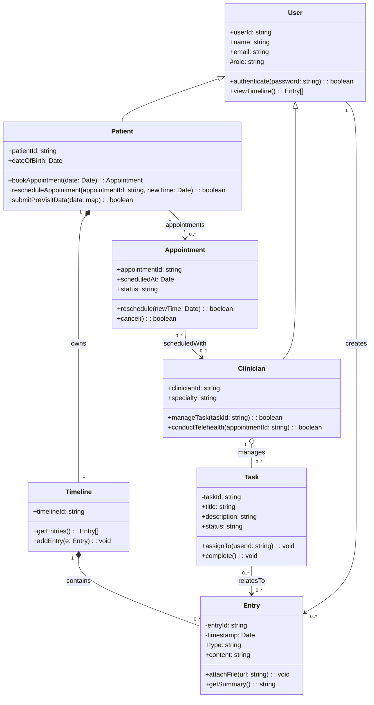

# Class Diagram

**Type:** Class Diagram
**Exported:** 2026-03-05T06:05:33.760Z
**Source:** PlanVersion

## Linked Requirements

- 21223f04-60ce-4f5f-8794-597065ef8dbc
- 6becae11-4e6e-4aff-9a73-0801e62c2fb0
- 79040c72-4468-4308-a44e-215e21d83d87
- bec630ec-c4dd-4348-a159-bb59c1be29f0
- f5c02e4a-eb53-4f9e-8d09-7590a4a9a3e0
- 4b989d63-1847-4314-9548-29845ecb9da8
- 897a82d5-a28d-41b7-8566-6967c89b03df
- e156fcd5-019c-40cb-8a6d-acd3048fe396

## Diagram

