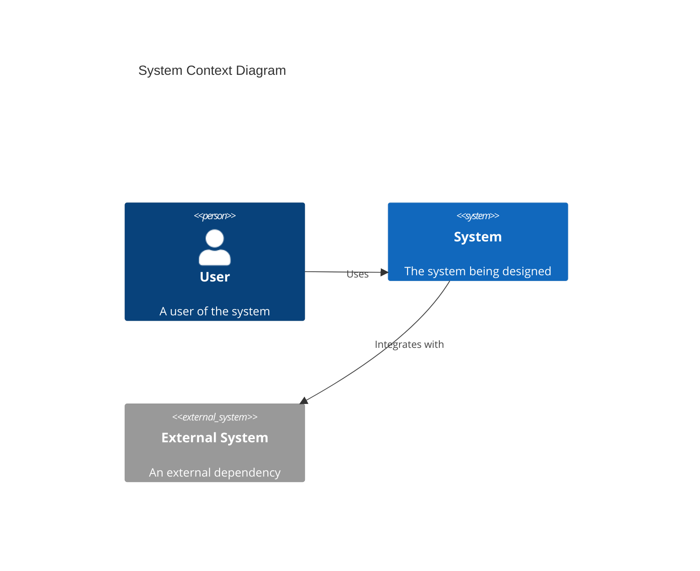

# example

**Type:** C4 Context
**Exported:** 2026-03-16T20:34:44.402Z
**Source:** PlanVersion

## Diagram

```mermaid
C4Context
    title System Context Diagram

    Person(user, "User", "A user of the system")
    System(system, "System", "The system being designed")
    System_Ext(external, "External System", "An external dependency")

    Rel(user, system, "Uses")
    Rel(system, external, "Integrates with")
```
