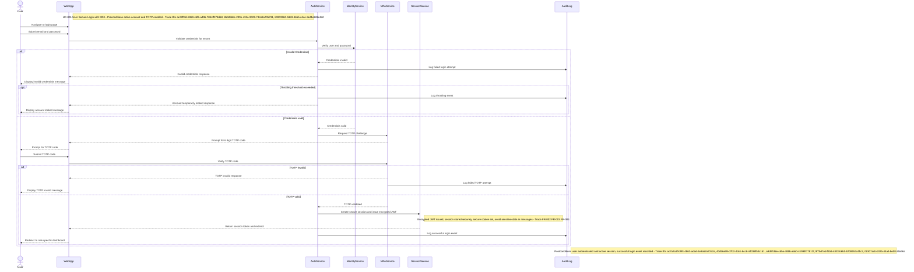

# Sequence Flow

**Type:** Sequence Diagram
**Exported:** 2026-03-06T05:00:08.053Z
**Source:** PlanVersion

## Linked Requirements

- fdf2c097-1cb9-4b69-a746-f7256e7acda7
- 47b5e19c-7014-424e-825e-d0cd1f8af9a3
- d020d77c-ddd7-4dda-a23f-0182e89b6595

## Diagram

